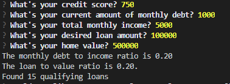

# BizOps_Qualifying_Loans

**Welcome to the `BizOps Loan Qualifying App`!**
This loan qualifying application can be used to help home loan companies generate qualifying loans generated with inquiring customer's inputs quickly and efficiently. This self sufficient end user process also allows the user to save the list of qualifying loans in a spreadsheet on their own file path folder that they provide.

---

## Technologies
**BizOps Qualifying Loan Application makes use of the Python Programming language and the Command Line Interface.*

This application was built using Python 3.7.9 64 bit

*[fire](fire) - For the command line interface, help page , and entry point.

*[questionary](questionary) - For interactive user prompts and dialog

*[sys](sys) - 

---

## Installation Guide

In order to have the application run smoothly you will need to install the following dependencies:
```python
pip install fire
pip install questionary
pip install sys
```
---

## Usage

Upon launching this application you will be prompted to input a file path for the daily_rate_sheet.csv
<p align="left">

</p>

The user will then put in the necessary information generated by the questionary prompts in order to calculate whether the user qualifies for any loans
<p align="left">

</p>

If the calculations generate that the user qualifies for loans, a prompt requests whether the user would like to save the qualifying loans as a csv file
<p align="left">

</p>

If the user selects "Y", then the user is prompted to provide a file path to save the csv file and the file is saved in the users provided folder path
<p align="left">

</p>
---

## Contributors

This application was created by Amrit Chahal.
Email inquiries: amritchahal@gmail.com 

---

## License

BizOps Inc.